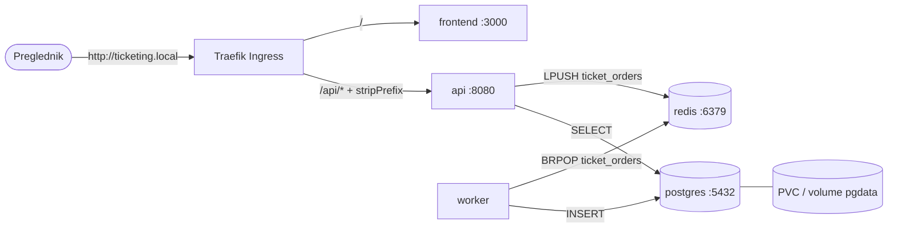

# Secure Event Ticketing Platform — DevSecOps projekt

Studentski projekt za kolegij **Uvod u DevOps — DevSecOps** (Sveučilište Algebra Bernays).
Repozitorij pokriva cijeli tok isporuke: kontejnerizaciju, lokalno okruženje kroz
Podman Compose, CI/CD sa sigurnosnim quality gateom i produkcijski deployment na
Kubernetes (k3s).

Ciljna platforma: **CentOS Stream 9**, rootless **Podman** + `podman-compose`, **k3s**.

---

## Dokumentacija

| Dokument | Sadržaj |
|----------|---------|
| [`docs/README-local.md`](docs/README-local.md) | **1. dio** — preduvjeti na CentOS 9 (Podman, firewalld, SELinux `:Z`), pokretanje kroz `podman-compose`, hot-reload profil, validacija svih endpointa i dokaz perzistencije |
| [`docs/README-deploy.md`](docs/README-deploy.md) | **2. dio** — instalacija k3s, firewalld pravila, kubeconfig, kreiranje Secreta, primjena manifesta, `/etc/hosts`, validacija, **rolling update** i **rollback** |
| [`docs/security/image-scan-report.md`](docs/security/image-scan-report.md) | Sigurnosno izvješće: naredbe za `trivy image/fs/config`, tablice nalaza s korektivnim mjerama (prije/poslije) i **politika taggiranja i objave slika** |
| [`docs/runbook.md`](docs/runbook.md) | Troubleshooting runbook — 7 incidentnih scenarija u formatu simptom / dijagnostika / uzrok / korektivna mjera / validacija |

---

## Arhitektura



| Servis | Tehnologija | Port | Uloga |
|--------|-------------|------|-------|
| `frontend` | Node.js + Express | 3000 | Web UI i `/config` endpoint |
| `api` | Node.js + Express | 8080 | REST API, health/readiness provjere |
| `worker` | Node.js | — | Pozadinska obrada queue poruka |
| `postgres` | PostgreSQL 16 (alpine) | 5432 | Trajna pohrana narudžbi |
| `redis` | Redis 7 (alpine) | 6379 | Queue između API-ja i workera |

Tok narudžbe: `POST /tickets/purchase` → Redis lista `ticket_orders` → `worker`
→ `INSERT` u PostgreSQL → vidljivo kroz `GET /tickets/orders`.

---

## Struktura repozitorija

```
.
├── api/                    Node.js REST API
│   ├── Containerfile       multi-stage (deps -> dev -> runtime), non-root UID 10001
│   ├── .dockerignore
│   └── package-lock.json   determinističke ovisnosti za `npm ci`
├── frontend/               Node.js static server (isti obrazac)
├── worker/                 Node.js queue consumer (isti obrazac)
├── infra/postgres/init.sql Inicijalizacija sheme baze
├── compose.yaml            Lokalno okruženje - 5 servisa, healthcheck, SELinux :Z
├── compose.dev.yaml        Override za hot-reload (nodemon, bind-mount)
├── k8s/                    Kubernetes manifesti za k3s (namespace `ticketing`)
│   ├── 00-namespace.yaml         Namespace + Pod Security Admission (restricted)
│   ├── 01-configmap.yaml         Ne-tajna konfiguracija
│   ├── 02-secret.example.yaml    PREDLOŽAK Secreta (samo placeholder!)
│   ├── 03-rbac.yaml              ServiceAccount + Role + RoleBinding
│   ├── 04-postgres.yaml          StatefulSet + PVC (local-path) + headless Service
│   ├── 05-redis.yaml             Deployment + Service
│   ├── 06-api.yaml               Deployment (2 replike) + Service + probe
│   ├── 07-worker.yaml            Deployment bez Servicea
│   ├── 08-frontend.yaml          Deployment + Service
│   ├── 09-ingress.yaml           Traefik Middleware (stripPrefix) + 2 Ingressa
│   └── 10-networkpolicy.yaml     default-deny + eksplicitne dozvole
├── .github/workflows/ci.yml      CI/CD s Trivy quality gateom
├── docs/                   Dokumentacija (vidi tablicu gore)
└── .env.example            Predložak varijabli okoline
```

---

## Brzi start — lokalno (Podman Compose)

```bash
cp .env.example .env
sed -i "s/^POSTGRES_PASSWORD=.*/POSTGRES_PASSWORD=$(openssl rand -base64 24 | tr -d '/+=')/" .env

podman-compose up -d --build
podman-compose ps
```

Validacija:

```bash
curl -s http://localhost:8080/healthz | jq .
curl -s http://localhost:8080/readyz  | jq .
curl -s http://localhost:8080/events  | jq .

curl -s -X POST http://localhost:8080/tickets/purchase \
  -H "Content-Type: application/json" \
  -d '{"eventId":"evt-1001","customerEmail":"student@algebra.hr","quantity":2}' | jq .

sleep 3
curl -s http://localhost:8080/tickets/orders | jq .

curl -s http://localhost:3000/healthz | jq .
# UI: http://localhost:3000
```

Razvojni profil s hot-reloadom:

```bash
podman-compose -f compose.yaml -f compose.dev.yaml up -d --build
```

> Detalji (firewalld, SELinux, dokaz perzistencije): [`docs/README-local.md`](docs/README-local.md)

---

## Brzi start — k3s

```bash
curl -sfL https://get.k3s.io | INSTALL_K3S_EXEC="--write-kubeconfig-mode 644" sh -
sudo install -o "$USER" -g "$USER" -m 600 /etc/rancher/k3s/k3s.yaml ~/.kube/config
export KUBECONFIG="$HOME/.kube/config"

# 1) Namespace i STVARNI Secret (nikad iz gita!)
kubectl apply -f k8s/00-namespace.yaml
kubectl create secret generic ticketing-secret -n ticketing \
  --from-literal=POSTGRES_PASSWORD="$(openssl rand -base64 24 | tr -d '/+=')"

# 2) Ostali manifesti (predlošci *.example.yaml se preskaču)
ls k8s/*.yaml | grep -v '\.example\.yaml$' | xargs -n1 kubectl apply -f

# 3) DNS unos
NODE_IP=$(kubectl get node -o jsonpath='{.items[0].status.addresses[?(@.type=="InternalIP")].address}')
echo "$NODE_IP  ticketing.local" | sudo tee -a /etc/hosts

# 4) Validacija
kubectl -n ticketing get pods
curl -s http://ticketing.local/api/readyz | jq .
```

> Detalji (firewalld, GHCR pristup, rolling update, rollback): [`docs/README-deploy.md`](docs/README-deploy.md)

---

## CI/CD pipeline

`.github/workflows/ci.yml` — pokreće se na `push`/`pull_request` prema `main`.

| Job | Sadržaj |
|-----|---------|
| `test` | Matrica `[api, frontend, worker]`: `npm ci`, `node --check src/*.js`, `npm audit --audit-level=high` |
| `secrets-scan` | `gitleaks` nad **poviješću commitova**, ne samo radnim stablom (`fetch-depth: 0`) |
| `lint-containerfiles` | `hadolint` na sva tri Containerfilea + `trivy config k8s/` (SARIF u Security tab) |
| `build-scan-push` | Build slike → **Trivy quality gate** (`HIGH,CRITICAL`, `ignore-unfixed`, `exit-code: 1`) → push u GHCR s tagovima `<git-sha>` i `latest` (samo `main`) |

Redoslijed je namjeran: **build → skeniranje → gate → push**. Ranjiva slika nikad ne
dolazi do registryja. Ovlasti workflowa su minimalne:
`contents: read`, `packages: write`, `security-events: write`.

Objavljene slike:
`ghcr.io/ikovacek95/ticketing-api`, `…-frontend`, `…-worker`

---

## Sigurnosne kontrole

**Slika (Containerfile)**
- Multi-stage build (`deps` → `runtime`); u finalnoj slici nema build alata ni dev-ovisnosti
- Pinana minimalna bazna slika `node:20.20-alpine3.22`
- **`npm`, `npx` i `yarn` uklonjeni iz runtime sloja** — aplikacija se pokreće s `node`, a npm-ovo stablo ovisnosti nosi CRITICAL/HIGH ranjivosti
- **`apk --no-cache upgrade`** — sigurnosne zakrpe OS paketa (OpenSSL i sl.)
- `npm ci --omit=dev --ignore-scripts` (deterministički, bez `postinstall` supply-chain rizika)
- Non-root korisnik s numeričkim UID-om **10001**, `COPY --chown=app:app`
- `HEALTHCHECK` (wget za HTTP servise, `pgrep` za worker)
- `.dockerignore` sprječava ulazak `.env`, `.git` i `node_modules` u slojeve slike

> Rezultat: **0 CRITICAL, 0 HIGH** u finalnim slikama (uz `--ignore-unfixed`).
> Put od 24 nalaza do nule dokumentiran je u [`docs/security/image-scan-report.md`](docs/security/image-scan-report.md) §2.

**Izvođenje (Compose)**
- `read_only: true` + `tmpfs /tmp`, `cap_drop: [ALL]`, `no-new-privileges:true`
- Baza i Redis nisu izloženi na host — samo unutar mreže `ticketing_net`
- Healthcheckovi + `depends_on: condition: service_healthy`

**Izvođenje (Kubernetes)**
- Namespace s Pod Security Admission profilom `restricted`
- `runAsNonRoot`, `runAsUser: 10001`, `seccompProfile: RuntimeDefault`
- `allowPrivilegeEscalation: false`, `readOnlyRootFilesystem: true`, `capabilities.drop: [ALL]`
- `resources` requests/limits na svim kontejnerima
- `startupProbe` + `livenessProbe` (`/healthz`), `readinessProbe` (`/readyz`)
- `Secret` odvojen od `ConfigMap`-a; `automountServiceAccountToken: false`
- RBAC s najmanjim privilegijama (bez pristupa Secretima)
- `NetworkPolicy`: default-deny ingress + eksplicitne bijele liste
- Rolling update `maxSurge: 1, maxUnavailable: 0` (nula prekida)

**Pipeline**
- `npm audit` (gate HIGH) · `gitleaks` · `hadolint` · `trivy image` (gate HIGH/CRITICAL) · `trivy config`
- SARIF izvještaji u GitHub Security tabu

Izvješće i politika objave: [`docs/security/image-scan-report.md`](docs/security/image-scan-report.md)

---

## API endpointi

| Metoda | Putanja | Opis | Odgovor |
|--------|---------|------|---------|
| `GET` | `/healthz` | Liveness — proces je živ | `200 {"status":"ok"}` |
| `GET` | `/readyz` | Readiness — provjera PostgreSQL + Redis | `200` / `503` |
| `GET` | `/events` | Popis dostupnih evenata | `200 [...]` |
| `POST` | `/tickets/purchase` | Kupnja karte → Redis queue | `202` / `400` / `404` |
| `GET` | `/tickets/orders` | Obrađene narudžbe iz PostgreSQL-a | `200 [...]` |

Frontend: `GET /healthz`, `GET /config` (vraća `{"apiBaseUrl": …}`), `GET /` (UI).

---

## Varijable okoline

| Varijabla | Zadano | Izvor u K8s | Opis |
|-----------|--------|-------------|------|
| `POSTGRES_DB` | `ticketing` | ConfigMap | Naziv baze |
| `POSTGRES_USER` | `ticketing_user` | ConfigMap | Korisnik baze |
| `POSTGRES_PASSWORD` | — | **Secret** | Lozinka — nikad u gitu |
| `POSTGRES_HOST` | `postgres` | ConfigMap | Host baze |
| `POSTGRES_PORT` | `5432` | ConfigMap | Port baze |
| `REDIS_HOST` | `redis` | ConfigMap | Host Redisa |
| `REDIS_PORT` | `6379` | ConfigMap | Port Redisa |
| `API_PORT` | `8080` | ConfigMap | Port API-ja |
| `FRONTEND_PORT` | `3000` | ConfigMap | Port frontenda |
| `QUEUE_NAME` | `ticket_orders` | ConfigMap | Naziv Redis liste |
| `NODE_ENV` | `production` | ConfigMap | Način rada Node.js-a |
| `API_BASE_URL` | `http://ticketing.local/api` | ConfigMap | Adresa API-ja **za preglednik** |

> `API_BASE_URL` mora biti adresa dostupna pregledniku (Ingress URL ili `http://localhost:8080`),
> a **ne** interno ime servisa poput `http://api:8080`.
